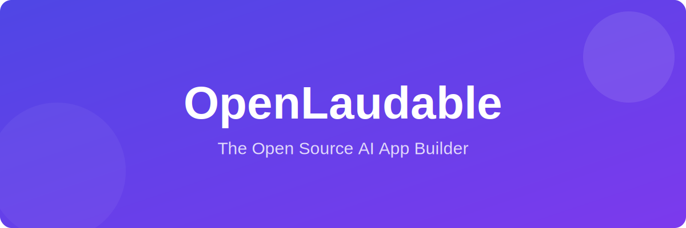

<div align="center">



# ✨ OpenLaudable✨

**The Ultimate Open-Source AI App Builder Alternative to Lovable, v0, and Bolt.new**

[](https://github.com/ishandutta2007/Open-Laudable/stargazers)
[](https://github.com/ishandutta2007/Open-Laudable/network/members)
[](https://opensource.org/licenses/Apache-2.0)
[](package.json)
[](CONTRIBUTING.md)

[Features](#-features) • [Quick Start](#-getting-started) • [Tech Stack](#-tech-stack) • [Comparison](#-comparison) • [Contributing](#-contributing)

</div>

---

## 📖 Introduction

**OpenLaudable** is a powerful, local-first, open-source AI application builder designed to give you the speed of proprietary tools like **Lovable**, **v0.dev**, and **Bolt.new** without the subscription fees or vendor lock-in. 

Build full-stack web applications from simple natural language prompts. Whether you need a CRM, a task manager, or a custom dashboard, OpenLaudablegenerates high-quality React code, manages your backend, and handles your database—all on your own machine.

### 🎯 Why OpenLaudable?
- **Privacy First**: Everything runs locally. Your prompts and code never leave your machine unless you want them to.
- **Zero Cost**: No "credits" or monthly subscriptions. Use your own API keys or local LLMs.
- **Full Ownership**: You own the code. Export it, tweak it, and deploy it anywhere.
- **Model Agnostic**: Supports OpenAI, Anthropic, Google Gemini, and local models via Ollama.

---

## 🚀 Features

- **🪄 Prompt-to-App**: Turn "Build a SaaS dashboard with user auth and dark mode" into a working app in seconds.
- **🛠️ Local Execution**: Runs entirely on your machine using Electron, ensuring maximum privacy and speed.
- **📦 Full-Stack Generation**: Generates React (TypeScript) frontends, Tailwind CSS styling, and integrated backends.
- **💾 Database Integration**: Built-in support for Supabase and SQLite for seamless data persistence.
- **🤖 Multi-Model Support**: Switch between GPT-4, Claude 3.5, Gemini 1.5, or local LLMs via Ollama.
- **⚡ Hot Reloading**: See your changes instantly as the AI refines your application.
- **🎨 Modern UI**: Beautiful default templates using Tailwind CSS and Lucide icons.
- **📁 Easy Export**: Download your project as a standard React/Vite project for production deployment.

---

## 🎥 Preview

<div align="center">
  
  <p><i>(Add a GIF or video here to show off OpenLaudablein action!)</i></p>
</div>

---

## 🛠️ Tech Stack

OpenLaudableis built with modern, industry-standard technologies:

- **Frontend**:   
- **Runtime**:  
- **Build Tool**: 
- **Database**:  
- **AI Orchestration**: [AI SDK](https://sdk.vercel.ai/) • [LangChain](https://www.langchain.com/)

---

## 🏁 Getting Started

### Prerequisites
- **Node.js**: v20 or higher
- **npm**: v11 or higher
- **Git**

### Installation

1. **Clone the repository**:
   ```bash
   git clone https://github.com/ishandutta2007/Open-Laudable.git
   cd OpenLaudable
   ```

2. **Install dependencies**:
   ```bash
   npm install
   ```

3. **Configure Environment**:
   - Copy `.env.example` to `.env`
   - Add your API keys (OpenAI, Anthropic, etc.)

4. **Run OpenLaudable**:
   ```bash
   npm start
   ```

---

## 📊 Comparison

| Feature | OpenLaudable| Lovable.dev | v0.dev | Bolt.new |
| :--- | :---: | :---: | :---: | :---: |
| **Pricing** | **Free (Local)** | Paid/Credits | Paid/Credits | Paid/Tokens |
| **Open Source** | **✅ Yes** | ❌ No | ❌ No | ❌ No |
| **Local-First** | **✅ Yes** | ❌ No | ❌ No | ❌ No |
| **Code Ownership** | **✅ 100%** | Partial | Partial | Partial |
| **Custom Models** | **✅ Any** | Fixed | Fixed | Fixed |

---

## 🤝 Contributing

We love contributions! Whether it's a bug fix, a new feature, or improving documentation:

1. **Fork** the repository.
2. **Create** a new branch (`git checkout -b feature/amazing-feature`).
3. **Commit** your changes (`git commit -m 'Add some amazing feature'`).
4. **Push** to the branch (`git push origin feature/amazing-feature`).
5. **Open** a Pull Request.

Please read [CONTRIBUTING.md](CONTRIBUTING.md) for more details.

---

## 📈 Star History

<div align="center">
  <a href="https://star-history.com/#ishandutta2007/Open-Laudable&Date">
    <picture>
      <source media="(prefers-color-scheme: dark)" srcset="https://api.star-history.com/chart?repos=ishandutta2007/Open-Laudable&type=date&theme=dark" />
      <source media="(prefers-color-scheme: light)" srcset="https://api.star-history.com/chart?repos=ishandutta2007/Open-Laudable&type=date" />
      
    </picture>
  </a>
</div>

---

## 📄 License

OpenLaudableis licensed under the **Apache 2.0 License**. See [LICENSE](LICENSE) for more information.

---

<div align="center">
  <p>Built with ❤️ by the OpenLaudableCommunity</p>
  <p>
    <a href="https://github.com/ishandutta2007/Open-Laudable/issues">Report Bug</a> •
    <a href="https://github.com/ishandutta2007/Open-Laudable/issues">Request Feature</a>
  </p>
</div>

<!-- SEO Keywords -->
<!-- open source alternative to Lovable AI app builder, free local AI web app generator, no-code AI development tool 2026, AI-powered full-stack app builder open source, best Lovable competitor for privacy-focused developers, react tailwind ai generator, prompt to app, bolt.new alternative, v0.dev alternative -->
